<div align="center">

  <a href="#_">
    
  </a>

  <br/><br/>

  <a href="#_">
    
  </a>

  <br/>

  <p align="center">
    <a href="https://aryamangarg.vercel.app/" target="_blank">
      
    </a>
    <a href="https://www.linkedin.com/in/aryaman-garg-696a66274/" target="_blank">
      
    </a>
    <a href="https://github.com/aryaman0406" target="_blank">
      
    </a>
    <a href="mailto:aryamangarg2005@gmail.com">
      
    </a>
  </p>

</div>

<hr/>

### About Me

```yaml
Name: Aryaman Garg
Location: Meerut / Bhopal, India
Education: B.Tech in CSE — VIT Bhopal University
Role: Full-Stack Developer & AI/ML Enthusiast
Focus: Scalable Web Applications & Applied Artificial Intelligence (AI/ML)
Currently Learning: Machine Learning, Generative AI & System Architecture
Interests: Open Source Collaboration, Software Engineering, Community Leadership
```

---

### Featured Projects

<table>
  <tr>
    <td width="50%" valign="top">
      <h3>ChemPulse-AI</h3>
      <p><i>AI &amp; Science</i></p>
      <p>Full-stack intelligent platform designed for molecular workflow analysis and automated predictive processing.</p>
      <p>
        
        
        
      </p>
      <p>
        <a href="https://chempulse-ai-1.onrender.com" target="_blank"><b>Live Demo</b></a> &bull; 
        <a href="https://github.com/aryaman0406" target="_blank"><b>Repository</b></a>
      </p>
    </td>
    <td width="50%" valign="top">
      <h3>MedTrack</h3>
      <p><i>HealthTech</i></p>
      <p>Comprehensive health management solution for tracking medication schedules, adherence analytics, and reminders.</p>
      <p>
        
        
        
      </p>
      <p>
        <a href="https://medication-tracker-vb5g.onrender.com" target="_blank"><b>Live Demo</b></a> &bull; 
        <a href="https://github.com/aryaman0406" target="_blank"><b>Repository</b></a>
      </p>
    </td>
  </tr>
  <tr>
    <td width="50%" valign="top">
      <h3>Hyperlocal AQI Monitoring</h3>
      <p><i>IoT &amp; Environment</i></p>
      <p>Real-time environmental telemetry platform aggregating air quality indicators with interactive visual analytics.</p>
      <p>
        
        
        
      </p>
      <p>
        <a href="https://hyperlocal-air-quality-monitoring-system-3pfi.onrender.com/" target="_blank"><b>Live Demo</b></a> &bull; 
        <a href="https://github.com/aryaman0406" target="_blank"><b>Repository</b></a>
      </p>
    </td>
    <td width="50%" valign="top">
      <h3>CostIntel-AI</h3>
      <p><i>FinTech &amp; AI</i></p>
      <p>AI-driven financial analytics engine providing predictive expense forecasting, anomaly detection, and budget optimization.</p>
      <p>
        
        
        
      </p>
      <p>
        <a href="https://costintel-ai-frontend.onrender.com/login" target="_blank"><b>Live Demo</b></a> &bull; 
        <a href="https://github.com/aryaman0406" target="_blank"><b>Repository</b></a>
      </p>
    </td>
  </tr>
</table>

---

### Tech Stack & Skills

<!-- Moving Skill Icons Banner -->
<div align="center">
  <a href="#_">
    
  </a>
</div>

<br/>

<table>
  <tr>
    <td width="50%" valign="top">
      <h4>Languages &amp; Core</h4>
      <p>
        
        
        
        
        
        
        
      </p>
      <h4>Frontend &amp; UI</h4>
      <p>
        
        
        
      </p>
      <h4>AI &amp; Machine Learning</h4>
      <p>
        
        
        
        
      </p>
    </td>
    <td width="50%" valign="top">
      <h4>Backend &amp; Frameworks</h4>
      <p>
        
        
        
        
      </p>
      <h4>Databases &amp; Cloud</h4>
      <p>
        
        
        
        
      </p>
      <h4>Tools &amp; Workflow</h4>
      <p>
        
        
        
        
      </p>
    </td>
  </tr>
</table>

---

### GitHub Statistics

<div align="center">
  <p align="center">
    <a href="#_">
      
    </a>
  </p>
  <p align="center">
    <a href="#_">
      
    </a>
  </p>
  <p align="center">
    <a href="#_">
      
    </a>
  </p>
</div>

---

<div align="center">
  <a href="#_">
    
  </a>
  <br/>
  <sub><i>"Building practical software and exploring AI to solve real-world problems."</i></sub>
</div>
